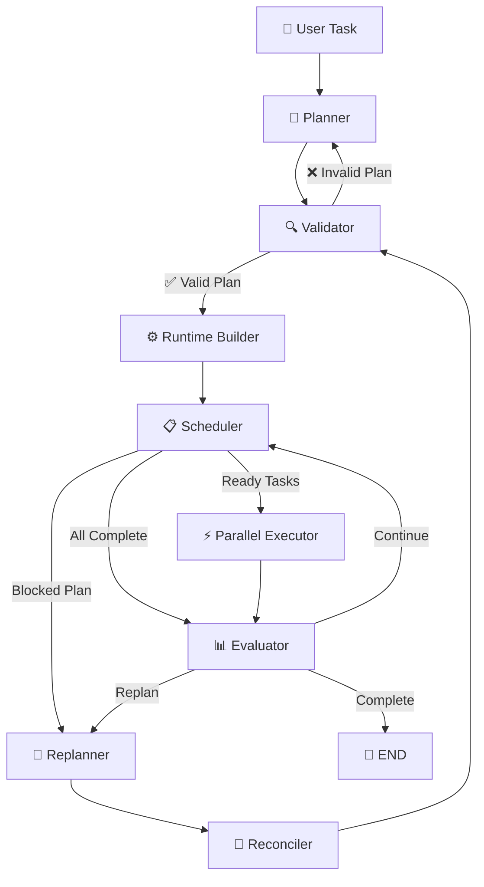

# ⚡ AgentPlanExecutor

### Dynamic Planning & Dependency-Aware Task Execution Engine for AI Agents

AgentPlanExecutor is a **LangGraph-based execution engine** that transforms a user request into a structured plan, validates dependencies, schedules executable tasks, runs independent tasks in parallel, evaluates progress, and dynamically replans when required.

<p align="center">


</p>

---

## 🧠 Architecture



---

## ✨ Features

- 🧠 **Structured LLM Planning**
- 🔍 **Dependency & Cycle Validation**
- 📋 **Dependency-Aware Scheduling**
- ⚡ **Parallel Task Execution**
- 📊 **Execution Evaluation**
- 🔄 **Dynamic Replanning**
- 🔗 **State Reconciliation**
- 🆔 **Stable Logical Task IDs**
- 🔀 **Conditional LangGraph Routing**

---

## 🚀 How It Works

```text
User Request
     ↓
Planner
     ↓
Validator
     ↓
Runtime Builder
     ↓
Scheduler
     ↓
Parallel Executor
     ↓
Evaluator
     ↓
 ┌──────────┬──────────┐
 │          │          │
Finish   Continue    Replan
 │          │          │
 ↓          ↓          ↓
END     Scheduler   Reconciler
                       ↓
                   Validator
```

---

## 📁 Project Structure

```text
AgentPlanExecutor/
│
├── src/
│   ├── schemas.py
│   ├── planner.py
│   ├── validator.py
│   ├── runtime.py
│   ├── scheduler.py
│   ├── executor.py
│   ├── evaluator.py
│   ├── replanner.py
│   ├── reconciler.py
│   ├── graph.py
│   │
│   └── prompts/
│       ├── planner_prompt.py
│       ├── evaluator_prompt.py
│       └── replanner_prompt.py
│
├── main.py
├── config.py
├── requirements.txt
├── .gitignore
└── README.md
```

---

## 🛠️ Setup

```bash
git clone <your-repository-url>
cd AgentPlanExecutor

python -m venv .venv
source .venv/bin/activate

pip install -r requirements.txt
```

Create a `.env` file:

```env
GROQ_API_KEY=your_groq_api_key
```

Run:

```bash
python main.py
```

---

## 📌 Example

### Input

```text
Create a Python data processing pipeline that reads a CSV file,
cleans missing values, calculates summary statistics,
and generates a final report.
```

### Generated Plan

```text
task_1: Read CSV into DataFrame
    Depends on: []

task_2: Clean Missing Values
    Depends on: [task_1]

task_3: Calculate Summary Statistics
    Depends on: [task_2]

task_4: Generate Final Report
    Depends on: [task_3]
```

### Execution

```text
Planner attempts:
1

Plan errors:
[]

Evaluation:
completed=True
continue_plan=False

Results:
task_1: Executed task: Read CSV into DataFrame
task_2: Executed task: Clean Missing Values
task_3: Executed task: Calculate Summary Statistics
task_4: Executed task: Generate Final Report
```

---

## 🧩 Problems Solved

| Problem | Solution |
|---|---|
| Invalid dependencies | Structured task IDs + validation |
| Dependency cycles | DFS cycle detection |
| Empty execution batches | Conditional scheduler routing |
| Stale results after replanning | Stable IDs + reconciliation |
| Mixed retry counters | Separate planner/replan counters |


---
## Author

**Venkata Varshith Reddy Mettukuru**

[GitHub](https://github.com/varshithreddy39)

## License

This repository is licensed under the [MIT License](./LICENSE).
