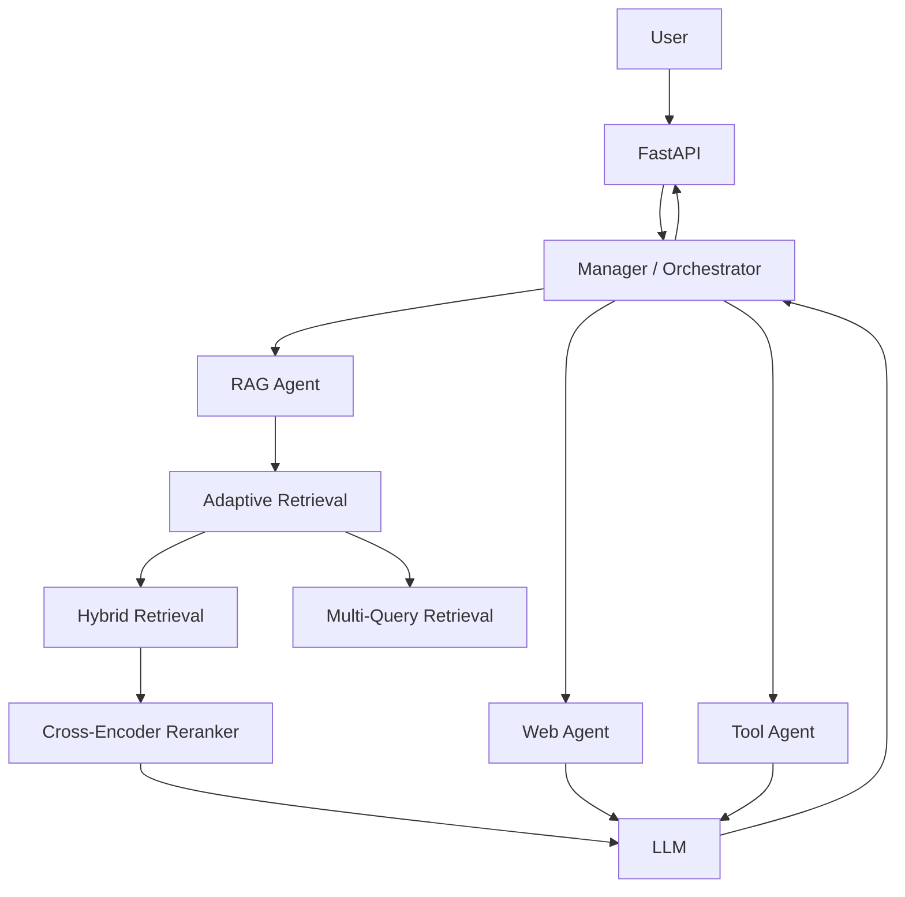
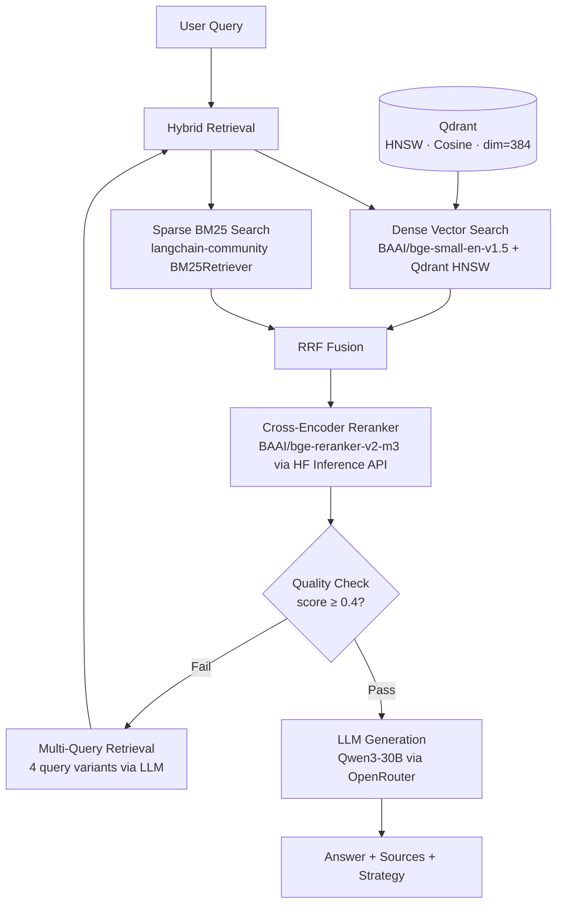

# Agentic Adaptive RAG

A production-oriented RAG system being extended toward an agentic architecture with tools, planning, memory, and orchestration.

---

## Overview

This project builds directly on the Adaptive RAG foundation from [Project 01](../01-adaptive-rag-pipeline/). The retrieval pipeline — hybrid search, multi-query expansion, reranking, and LLM generation — is carried forward and extended toward a fully agentic system with multiple specialized agents, tool use, memory, and a central orchestrator.

The RAG pipeline is complete. The agentic layer is under active development.

---

## Architecture

The planned architecture introduces a Manager/Orchestrator that routes work across a RAG Agent, Web Agent, and Tool Agent. The RAG Agent wraps the full retrieval pipeline from Project 01.

> The Manager, Web Agent, Tool Agent, memory, and planning components are still under development.



---

## RAG Pipeline

The current working pipeline. Handles query routing, hybrid retrieval, reranking, quality checking, and answer generation.



**Flow:**

1. Hybrid retrieval runs dense vector search (Qdrant) and BM25 in parallel, fused with RRF.
2. Retrieved documents are reranked using `BAAI/bge-reranker-v2-m3` via the HuggingFace Inference API.
3. The top reranker score is checked against a threshold (0.4).
4. If quality is poor, MQR generates 4 query variants using the LLM and re-runs hybrid retrieval, deduplicating across all variants.
5. Final context is passed to `Qwen3-30B` via OpenRouter to generate the answer with sources.

---

## Tech Stack

| Layer | Technology | Details |
|---|---|---|
| API | FastAPI | REST endpoints, async |
| Embeddings | `BAAI/bge-small-en-v1.5` | HuggingFace, 384-dim, normalized |
| Vector Store | Qdrant | HNSW index, cosine distance, on-disk payload |
| Sparse Retrieval | BM25 | `langchain-community` BM25Retriever |
| Hybrid Fusion | RRF | Reciprocal Rank Fusion (k=60) |
| Reranker | `BAAI/bge-reranker-v2-m3` | HuggingFace Inference API, cross-encoder |
| LLM | `Qwen3-30B-A3B` | Via OpenRouter, `langchain-openai` |
| Orchestration | LangChain | Prompts, message types, structured output |
| Containerization | Docker + Docker Compose | Backend + Qdrant |

---

## Current Progress

| Component | Status |
|---|---|
| Document ingestion | ✅ Complete |
| Document splitting | ✅ Complete |
| Embeddings | ✅ Complete |
| Qdrant vector store | ✅ Complete |
| BM25 retrieval | ✅ Complete |
| Hybrid retrieval + RRF | ✅ Complete |
| Multi-query retrieval | ✅ Complete |
| Cross-encoder reranking | ✅ Complete |
| LLM layer | ✅ Complete |
| RAG query pipeline | ✅ Complete |
| Chat API endpoint | ⏳ Planned |
| Memory | ⏳ Planned |
| Tools | ⏳ Planned |
| RAG Agent | ⏳ Planned |
| Planning / Orchestration | ⏳ Planned |
| Frontend | ⏳ Planned |

---

## Project Structure

```text
agentic-adaptive-rag/
├── backend/
│   ├── config/
│   │   └── settings.py          # All model, retrieval, and infra config
│   ├── rag/
│   │   ├── loder.py             # Document loading (PDF, DOCX, CSV, Web)
│   │   ├── splitter.py          # Type-aware chunking
│   │   ├── embeddings.py        # HuggingFace embedding manager
│   │   ├── vector.py            # Qdrant vector store manager
│   │   ├── pipline.py           # RAG query pipeline (hybrid → rerank → LLM)
│   │   ├── llm/
│   │   │   └── llm.py           # LLM manager via OpenRouter
│   │   ├── retriever/
│   │   │   ├── vector.py        # Dense vector retriever
│   │   │   ├── bm25.py          # BM25 sparse retriever
│   │   │   ├── hybrid.py        # Hybrid retriever with RRF fusion
│   │   │   ├── mqr.py           # Multi-query retriever
│   │   │   └── reranker.py      # Cross-encoder reranker
│   │   └── prompts/
│   │       ├── system_prompt.py
│   │       ├── mqr_prompt.py
│   │       └── prompt_builder.py
│   ├── routers/
│   │   ├── health_check.py
│   │   └── ingestion.py
│   ├── services/
│   │   └── ingestion_service.py
│   ├── memory/                  # Planned
│   ├── models/                  # Planned
│   └── tools/                   # Planned
├── docker-compose.yml
└── README.md
```

---

## Roadmap

```text
[x] Document ingestion pipeline
[x] Hybrid retrieval (dense + BM25 + RRF)
[x] Multi-query retrieval
[x] Cross-encoder reranking
[x] LLM layer
[x] RAG query pipeline
[ ] Chat API endpoint
[ ] Conversation memory
[ ] Tool use
[ ] RAG Agent
[ ] Manager / Orchestrator
[ ] Planning
[ ] Agent evaluation
[ ] Frontend
```
