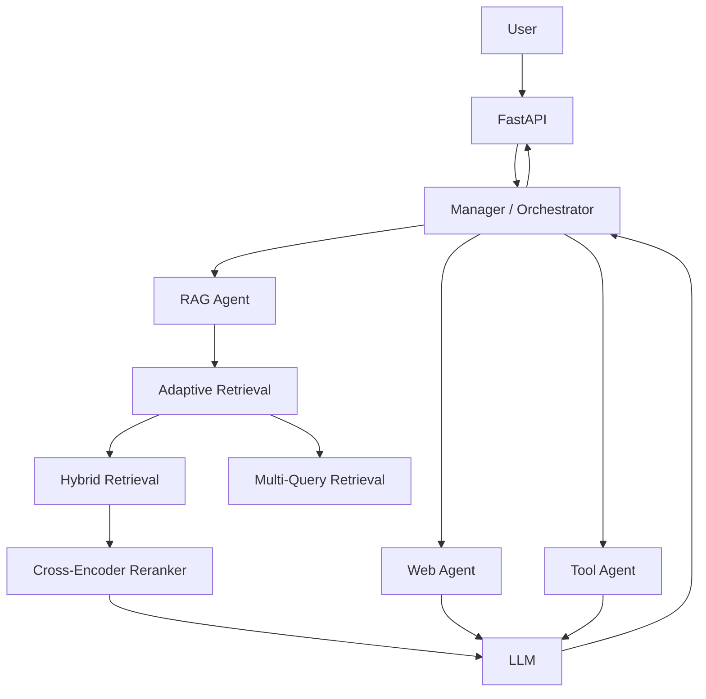
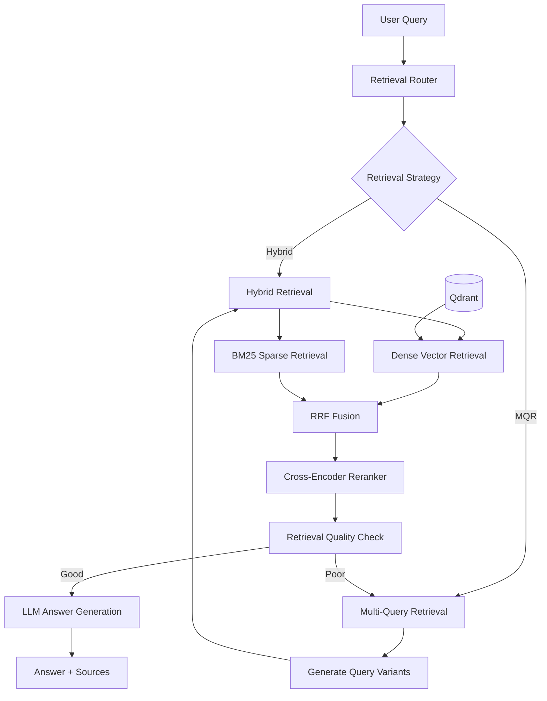

# Agentic Adaptive RAG

A production-oriented RAG system being extended toward an agentic architecture with tools, planning, memory, and orchestration.

---

## Overview

This project builds directly on the Adaptive RAG foundation from [Project 01](../01-adaptive-rag-pipeline/). The retrieval pipeline — hybrid search, multi-query expansion, reranking, and LLM generation — is carried forward and extended toward a fully agentic system with multiple specialized agents, tool use, memory, and a central orchestrator.

The agentic layer is currently under active development.

---

## Architecture

The planned architecture introduces a Manager/Orchestrator that routes work across a RAG Agent, Web Agent, and Tool Agent. The core retrieval logic from Project 01 powers the RAG Agent.

> The Manager, Web Agent, Tool Agent, memory, and planning components are still under development.



---

## RAG Pipeline

The current working pipeline handles query routing, hybrid retrieval, reranking, quality checking, and answer generation.



**Flow:**

1. The user sends a query.
2. The retrieval router selects the initial retrieval strategy.
3. Hybrid retrieval combines dense vector search and BM25 using RRF fusion.
4. MQR generates multiple query variations when broader retrieval coverage is useful.
5. Retrieved documents are reranked using a cross-encoder model.
6. Retrieval quality is evaluated against a confidence threshold.
7. If quality is poor, the system falls back to MQR for a second attempt.
8. The final context is passed to the LLM to generate the answer with sources.

---

## Current Progress

| Component                | Status         |
|--------------------------|----------------|
| Document ingestion       | ✅ Complete     |
| Document splitting       | ✅ Complete     |
| Embeddings               | ✅ Complete     |
| Qdrant vector store      | ✅ Complete     |
| BM25 retrieval           | ✅ Complete     |
| Hybrid retrieval         | ✅ Complete     |
| Multi-query retrieval    | ✅ Complete     |
| Reranking                | ✅ Complete     |
| LLM layer                | ✅ Complete     |
| Query pipeline           | 🚧 In Progress |
| Chat API                 | ⏳ Planned      |
| Memory                   | ⏳ Planned      |
| Tools                    | ⏳ Planned      |
| RAG Agent                | ⏳ Planned      |
| Planning / Orchestration | ⏳ Planned      |
| Frontend                 | ⏳ Planned      |

---

## Tech Stack

- Python
- FastAPI
- LangChain
- Qdrant
- HuggingFace
- OpenRouter
- Docker

---

## Project Structure

```text
agentic-adaptive-rag/
├── backend/
│   ├── config/
│   ├── rag/
│   ├── routers/
│   ├── services/
│   ├── memory/
│   ├── models/
│   └── tools/
├── docker-compose.yml
└── README.md
```

---

## Roadmap

```text
[x] RAG foundation
[ ] Query pipeline
[ ] Chat API
[ ] Memory
[ ] Tools
[ ] RAG Agent
[ ] Manager / Orchestrator
[ ] Planning
[ ] Agent evaluation
[ ] Frontend
```
