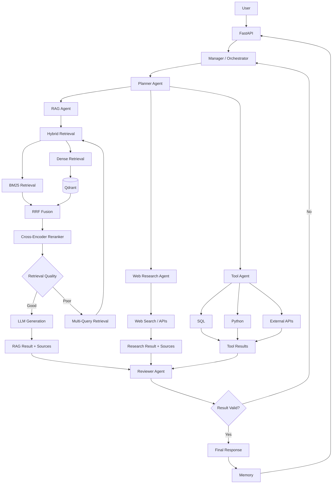

# Agentic Adaptive RAG

A production-oriented **multi-agent RAG system** designed to combine adaptive retrieval, planning, tool use, web research, memory, and agent orchestration.

The system builds on an existing Adaptive RAG pipeline and extends it into an agentic architecture using **LangGraph**.

---

## Overview

Agentic Adaptive RAG is designed to solve both simple and complex user queries by dynamically deciding how the task should be handled.

Instead of following a fixed RAG workflow for every query, the system introduces specialized agents that can:

* Retrieve information from documents
* Search the web
* Use external tools
* Decompose complex tasks
* Delegate tasks between agents
* Maintain conversation context
* Review and validate results
* Re-plan when execution fails

The existing Adaptive RAG system acts as the retrieval engine behind the **RAG Agent**.

---

## Architecture



### Overall Execution

```text
User
  ↓
FastAPI
  ↓
Manager / Orchestrator
  ↓
Planner
  ↓
┌───────────────┬──────────────────┬────────────────┐
│               │                  │
▼               ▼                  ▼
RAG Agent       Web Agent          Tool Agent
│               │                  │
│               │                  ├── SQL
│               │                  ├── Python
│               │                  └── APIs
│               │
│               └── Web Search
│
├── Dense Retrieval
├── BM25
├── RRF
├── Reranking
├── Quality Check
└── MQR
        │
        ▼
     Results
        │
        └──────────────┬──────────────┘
                       ▼
                 Reviewer Agent
                       │
                 ┌─────┴─────┐
                 │           │
               Valid       Invalid
                 │           │
                 ▼           ▼
              Answer      Re-plan
                 │
                 ▼
               Memory
                 │
                 ▼
                User
```

---

## Core Components

### Manager / Orchestrator

Coordinates the overall agent workflow and controls how tasks move through the system.

### Planner Agent

Decomposes complex user requests into smaller executable tasks and determines which specialized agents are required.

### RAG Agent

Provides document-grounded reasoning using the existing Adaptive RAG pipeline:

* Dense vector retrieval
* BM25 sparse retrieval
* Hybrid retrieval
* RRF fusion
* Multi-Query Retrieval
* Cross-encoder reranking
* Retrieval quality checking
* LLM generation
* Source attribution

### Web Research Agent

Retrieves information from external sources when the required information is not available in the local knowledge base.

### Tool Agent

Provides access to computational and external capabilities such as:

* SQL
* Python
* External APIs
* Data analysis

### Reviewer Agent

Evaluates agent outputs, retrieved evidence, and tool results before the final response is returned.

The reviewer can reject an output and send the workflow back for another execution cycle.

### Memory

Maintains relevant conversation and execution context across interactions.

---

## Technology Stack

| Layer | Technology |
|---|---|
| Backend | FastAPI |
| Agent Orchestration | LangGraph |
| LLM Framework | LangChain |
| LLM | Qwen3-30B-A3B |
| LLM Gateway | OpenRouter |
| Embeddings | BAAI/bge-small-en-v1.5 |
| Vector Database | Qdrant |
| Sparse Retrieval | BM25 |
| Hybrid Fusion | RRF |
| Reranker | BAAI/bge-reranker-v2-m3 |
| Containerization | Docker |
| Service Management | Docker Compose |

---

## Project Structure

```text
agentic-adaptive-rag/
│
├── backend/
│   │
│   ├── config/
│   │   └── settings.py
│   │
│   ├── rag/
│   │   ├── README.md
│   │   ├── loder.py
│   │   ├── splitter.py
│   │   ├── embeddings.py
│   │   ├── vector.py
│   │   ├── pipline.py
│   │   │
│   │   ├── llm/
│   │   │   └── llm.py
│   │   │
│   │   ├── retriever/
│   │   │   ├── vector.py
│   │   │   ├── bm25.py
│   │   │   ├── hybrid.py
│   │   │   ├── mqr.py
│   │   │   └── reranker.py
│   │   │
│   │   └── prompts/
│   │       ├── system_prompt.py
│   │       ├── mqr_prompt.py
│   │       └── prompt_builder.py
│   │
│   ├── agents/
│   │   ├── planner.py
│   │   ├── rag_agent.py
│   │   ├── web_agent.py
│   │   ├── tool_agent.py
│   │   └── reviewer.py
│   │
│   ├── graph/
│   │   ├── state.py
│   │   ├── nodes.py
│   │   ├── edges.py
│   │   └── workflow.py
│   │
│   ├── memory/
│   │
│   ├── tools/
│   │   ├── sql.py
│   │   ├── python.py
│   │   └── web.py
│   │
│   ├── models/
│   │
│   ├── routers/
│   │   ├── health_check.py
│   │   └── ingestion.py
│   │
│   └── services/
│       └── ingestion_service.py
│
├── docker-compose.yml
├── README.md
└── LICENSE
```

---

## Current Progress

| Component | Status |
|---|---|
| Document ingestion | ✅ Complete |
| Document splitting | ✅ Complete |
| Embeddings | ✅ Complete |
| Qdrant vector store | ✅ Complete |
| BM25 retrieval | ✅ Complete |
| Hybrid retrieval + RRF | ✅ Complete |
| Multi-query retrieval | ✅ Complete |
| Cross-encoder reranking | ✅ Complete |
| LLM layer | ✅ Complete |
| RAG query pipeline | ✅ Complete |
| LangGraph graph setup | ⏳ Planned |
| Planner Agent | ⏳ Planned |
| RAG Agent | ⏳ Planned |
| Web Research Agent | ⏳ Planned |
| Tool Agent | ⏳ Planned |
| Reviewer Agent | ⏳ Planned |
| Manager / Orchestrator | ⏳ Planned |
| Memory | ⏳ Planned |
| Chat API endpoint | ⏳ Planned |
| Frontend | ⏳ Planned |

---

## Design Principles

* **Agent specialization** — each agent has a clearly defined responsibility.
* **Adaptive execution** — workflows can change based on intermediate results.
* **Grounded generation** — RAG responses are supported by retrieved evidence.
* **Tool augmentation** — agents can use external tools when required.
* **Stateful orchestration** — execution state is maintained across the workflow.
* **Evaluation and verification** — outputs can be reviewed before reaching the user.
* **Modularity** — agents, tools, retrieval, and orchestration remain independently extensible.

---

## License

This project is licensed under the **MIT License**.

See the [`LICENSE`](../LICENSE) file for details.
