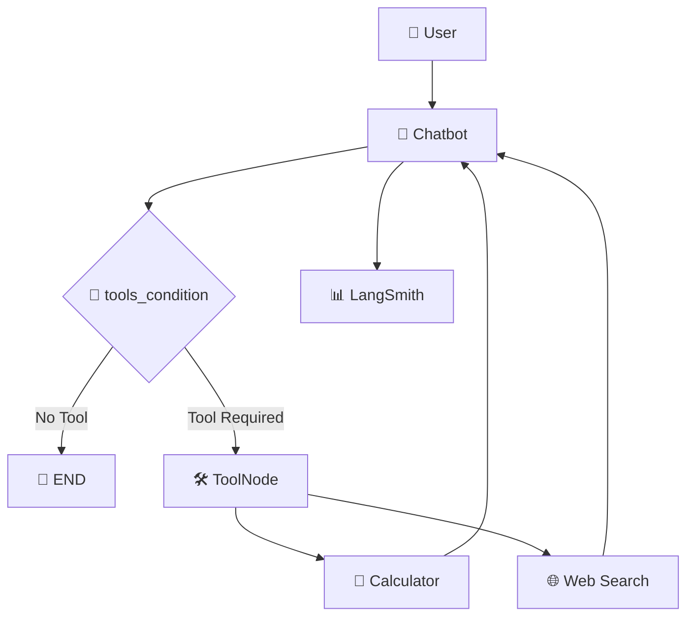

# ⚡ AgentTrace

**LangGraph-Based Tool-Calling Agent with Web Search, Memory & Observability**

AgentTrace is a LangGraph-based AI agent built to explore core Agent Engineering concepts including state management, tool calling, conditional routing, threads, persistence, and LangSmith observability.

<p align="center">
  <!-- Add banner/demo GIF here -->
</p>

---

## 🧠 Architecture



---

## ✨ Features

- 🧠 LangGraph `StateGraph`
- 📝 Typed state with `TypedDict`
- 🔄 Message state with reducers
- 🛠️ LLM tool calling
- 🔀 Conditional tool routing
- 🧮 Calculator tool
- 🌐 SerpAPI web search
- 🧩 LangGraph `ToolNode`
- 🧵 Thread-based conversations
- 💾 LangGraph persistence
- 🔍 LangSmith tracing
- 📊 Token usage tracking
- ⏱️ Latency monitoring
- 💰 Cost tracking
- 🖥️ LangGraph Studio

---

## 🚀 How It Works

```
User Request
     ↓
  Chatbot
     ↓
LLM decides
     ↓
 ┌───────────────┐
 │               │
No Tool       Tool Required
 │               │
 ↓               ↓
END          ToolNode
              ↓
       ┌──────┴──────┐
       ↓             ↓
 Calculator      Web Search
       │             │
       └──────┬──────┘
              ↓
           Chatbot
              ↓
             END
```

### Example

```
Search the web for the current population of India,
then multiply that population by 2.
```

The agent can execute:

```
Chatbot
   ↓
Web Search
   ↓
Chatbot
   ↓
Calculator
   ↓
Chatbot
   ↓
Final Response
```

---

## 🔍 LangSmith Observability

AgentTrace integrates with LangSmith to inspect complete agent executions.

It provides visibility into:

- LLM calls
- Tool calls
- Input tokens
- Output tokens
- Reasoning tokens
- Latency
- Estimated cost
- Errors
- Complete execution traces

### Example run

```
Execution Time: 10 seconds
Input Tokens:   6,067
Output Tokens:    681
Reasoning:        399
Total Tokens:   6,748
Estimated Cost: $0.0013
```

---

## 📁 Project Structure

```
AgentTrace/
│
├── src/
│   ├── graph.py
│   ├── state.py
│   ├── schemas.py
│   ├── models.py
│   ├── prompts.py
│   ├── tools.py
│   │
│   ├── nodes/
│   │   └── chatbot.py
│   │
│   └── memory/
│       └── checkpointer.py
│
├── tests/
│   └── test_graph.py
│
├── .env.example
├── .gitignore
├── langgraph.json
├── requirements.txt
├── pyproject.toml
└── README.md
```

---

## 🛠️ Setup

```bash
git clone <your-repository-url>
cd AgentTrace

python3 -m venv .venv
source .venv/bin/activate

pip install -r requirements.txt
```

Create a `.env` file:

```env
GROQ_API_KEY=your_groq_api_key
GROQ_MODEL=openai/gpt-oss-120b

SERPAPI_API_KEY=your_serpapi_api_key

LANGSMITH_API_KEY=your_langsmith_api_key
LANGSMITH_TRACING=true
LANGSMITH_PROJECT=AgentTrace
```

Run:

```bash
langgraph dev
```

For LangGraph Studio:

```bash
langgraph dev --tunnel --no-browser
```

---

## 🎯 Learning Goals

AgentTrace was built to understand:

```
State
 ↓
Nodes
 ↓
Edges
 ↓
Conditional Routing
 ↓
Tool Calling
 ↓
ToolNode
 ↓
Threads & Persistence
 ↓
LangSmith Observability
```

---

## 🚧 Future Improvements

- [ ] Automatic UUID-based thread creation
- [ ] User-level persistence
- [ ] Long-term memory
- [ ] Human-in-the-loop
- [ ] Planning & replanning
- [ ] Agent evaluation
- [ ] Error recovery
- [ ] Production deployment
- [ ] Custom chat frontend

---

## 👨‍💻 Author

**Venkata Varshith Reddy Mettukuru**
[GitHub](https://github.com/varshithreddy39)

## 📄 License
This repository is licensed under the [MIT License](./license).
